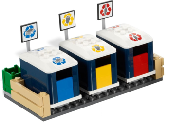

# iot_solutions_for_smart_city
> “Wireless Made Fun!" - IoT Solutions for Smart City

1. [Facts and challenges of Smart City](#step1)
1. [Our solution : "IoT Solutions for Smart City"](#step2)
	1. [System architecture](#step2a)
	1. [Hygiene and Safety (disinfection & cleaning services): Mouse/Rat trap](#step2b)
	1. [Smart Home & Smart Building](#step2c)
	1. [Smoke & CO detection](#step2d)
	1. [Street Lighting, Waste Management and Parking Management](#step2e)
	1. [Energy Management and Smart Factory](#step2f)
1. [Do It Yourself](#step3)
	1. [Bill of materials](#step3a)
	1. [Step by step guide](#step3b)
	1. [Hardware](#step3c)
	1. [Software](#step3d)
		1. [Smart Home & Building Applications](#step3d1)
		1. [MiWi Mesh Application](#step3d2)
		1. [Smart City Dashboard](#step3d3)

## Facts and challenges of Smart City 

With the Internet of Things, our world gets smarter. And will get even smarter as Machine Learning, Cloud and Edge Artificial Intelligence along other analytics functions get deployed in broader scale. 
Sensors, actuators, connected devices are now everywhere, including in our house (Smart Home), in our working environment (Smart Building and even Smart Industry), in our neighborhood (Smart City). Even in the countryside (Smart Agriculture).  
But all these objects have different purpose and use cases leading to different technical constraints in performance, range, or battery life. Different technologies will then be needed to cover these multiple applications as there is no 1 size fits all. 
Some devices will also support several protocols to bridge and connect multiple ecosystems together. 
Some protocols evolve always adding new features and patches to get more robust… or protect them against always increasing security threats. Others get obsoleted and simply disappear! 

Here come the challenges for developers building Smart Home, Smart Building, Smart City solutions:
1. Quickly adapt to always evolving standards, and complex environment
2. Shorten time to market: scaling development is a must
3. Wireless is a complex technologies and leads to many troubles and delays: how to mitigate them
4. Vulnerability is not an option, highest cyber-security standards are required

## Our solution : "IoT Solutions for Smart City" 

 

To help you go through these challenges, Microchip Technology has built this demonstrator, integrating our state-of-the-art solutions with a focus on scalability, robustness and security. This platform manages a broad range list of technologies, illustrating multiple applications such as:
- Smart Industry, Power Plant (production)
- Smart City, Energy Management (global management from consumption to production)
- Smart Industry, Power Plant (production)
- Smart City, Street Lighting
- Smart City, Waste Management
- Smart City, Parking Management
- Smart City, tracking & geolocation
- Smart Home & Smart Building, Hygiene and Safety (disinfection & cleaning services)
- Smart Home & Smart Building, Access Control, Alarm & Security
- Smart Home & Smart Building, Smart Lock 
- Smart Home & Smart Building, Lighting Control 
- Smart Home & Smart Building, Heating Control 
- Smart Home & Smart Building, Smoke & CO detection 
- Smart Home & Smart Building, Energy Management (Solar Panel & Metering) 
- Smart Agriculture, tracking & geolocation
- Smart Agriculture, sensors & monitoring

Technologies demonstrated here will be:
- Robust Star Network based on Long Range Sub GHz protocol 
- LoRaWAN infrastructure supporting Class A and C with Join Server connectivity 
- Wi-Fi Connectivity
- Bluetooth BLE Connectivity
- Secure Element, to build robust and secure network 

<!--
An overview of this demonstrator is shown in this video: 

 
-->

And enjoy this Github session
 

### System architecture 

This demonstrator is made of 3 distinct Lego blocks, each of them illustrating different applications and uses cases. They are:
- City Buildings with its 8 apartments (picture on the left)
- Street plates (picture in the middle)
- Windmill sitting on top of small hill (picture on the right

**The City Building stores all the electronics boards** controlling the use cases of the whole demonstrators as shown below : Smart Home, Smart Building, Smart City, Smart Industry, Smart Agriculture

There is one exception: a mouse trap from Xignal sits on a Lego street plate and illustrate the Hygiene and Safety use case. This solution from Signal typically traps rodents in buildings, warehouses or parks. 
It operates as standalone Class A device, battery powered and connected to the same LoRaWAN network. More details are provided in the use case section and here www.xignal.com.

The street plates are used to hold sensors (1 light sensor and 1 magnetic sensor) and actuators (total of 6 LEDs embedded in street polls) as shown below. 
We also have added 2 Mosfet drivers to boost up the intensity of LEDs (1 driver per 3 Street Polls).

Windmill is made of DC motor and LED, to simulate the production of Energy used by our Smart City. Production will show on the Smart City dashboard.

### Hygiene and Safety (disinfection & cleaning services): Mouse/Rat trap

We have selected here this smart solutions from Xignal (see https://www.xignal.com/) which are proposed in many flavors:

Used by professional (building management services) as an intelligent and sustainable pest control, it detects the status of the mouse or rat trap located in a building, warehouse or outside (garden, park…): armed, unarmed or unarmed with catch. By a push notification on its mobile or tablet, online 24/7 reports are generated listing rodent activities. A big advantage for professional for intensive and efficient inspections (it saves costs). The non-tox digital trapping fits in with integrated pest management.

This end product commercialized by Xignal is based on RN2483 network controller from Microchip (www.microchip.com/RN2483) and connects to LoRaWAN network, using Class A. 
RN2483 easily connects to any host MCU, driven with ASCII command interface over an UART.  
In this specific product, a tiny 8-bit MCU has been used : ATMEGA328PB-AU (www.microchip.com/wwwproducts/en/ATmega328PB)

### Smart Home & Smart Building

This block illustrates 3 use cases of a typical Smart Home & Smart Building environment: 
- Access Control, Alarm & Security
- HVAC Control (Heating, ventilation, and air conditioning
- Lighting Control

This system is built around a central unit, interacting with several embedded sensors and actuators (thru Star wireless network or directly wired to this central point), interfacing with a smart phone (thru smart lock via Bluetooth) or interfacing with dashboard for overall system monitoring and control (MQTT connectivity via Wifi). 
Overall system looks like this:

Several SAMR34 Xplained Pro Evaluation Kits (<a href="https://www.microchip.com/DevelopmentTools/ProductDetails/dm320111" target="_blank">DM320111</a>) have been used here to build this environment. Depending on the use case, these boards have been configured either as Central Unit (to say our system gateway), sensor node or actuator.

The Central unit is the master node of our system, the SAM34 MCU (Cortex M0+ with 256k Flash) managing every single block of our system. 
It acts as smart gateway between the different application ecosystems:
- Smart Home Network related apartments 2, 3, 5 and 6 (lighting and heating controls). This is a Star Network protocol over Lora SubGHz radio, our central unit acting as PAN coordinator, and actuators and sensors being the end nodes (here 4 nodes in total)
- Access Control. Central unit is connected to PIC-BLE Development Board (Reference <a href="https://www.microchip.com/DevelopmentTools/ProductDetails/DT100112" target="_blank">DMT100112</a>) : a Smart Phone using LightBlue® App can now push a pin code to the gateway which would then disarms the alarm if password gets validated.
- Door Strike, Alarm buzzer and light, Alarm Sensor. All these nodes are here wired directly to the gateway although in real life some of these devices would be connected in wireless (alarm sensors). 

The Central Unit is also connected to the cloud thru Wi-Fi and MQTT protocol, using the WINC1500 XPRO extension bord from Microchip (Reference <a href="https://www.microchip.com/DevelopmentTools/ProductDetails/ATWINC1500-XPRO" target="_blank">ATWINC1500-XPRO</a>). This board is based around an ATWIC1500, single-band 2.4GHz b/g/n IoT Network Controller embedding Wi-Fi and Network capabilities through SPI-to-Wi-Fi interface. 

To further enhance our system, we could have added a Secure Element, pre-configured and pre-provisioned for a given cloud vendor. Customers following that path could then have a quick and easy secure authentication to several popular solutions such as AWS, Azure or Google GCP. 
For more information, refers to <a href="https://www.microchip.com/design-centers/security-ics/trust-platform" target="_blank">Microchip's Trust&Go platform</a>. Examples are provided based on same WINC1500 Wi-Fi module, used here:

Going back to our development, system data related to this application can then be displayed on a dashboard as shown below:

LightBlue App is provided by Punch Through Design and available for both <a href="https://play.google.com/store/apps/details?id=com.punchthrough.lightblueexplorer&hl=fr" target="_blank">Google Play Store</a> and <a href="https://apps.apple.com/fr/app/lightblue/id557428110" target="_blank">Apple App Store</a>).  
For more information on this solution refers to Microchip PIC-BLE Development Board (Reference <a href="https://www.microchip.com/DevelopmentTools/ProductDetails/DT100112" target="_blank">DMT100112</a>).

### Smoke & CO detection

Connectivity brings system safety to the next level compared to standalone detectors, ensuring that any alert gets identified sooner (or simply identified at all), shared to broader audience locally, and last communicated real time to concerned safety/security departments. 

Maintenance could also be automated with more frequent check-up (battery!). It increases system safety and robustness, while improving overall efficiency (less time-consuming and unnecessary inspections). 

Connectivity could be implemented thru different topologies, interconnecting sensors together thru a Point to Point communication (P2P). Or connected them directly to the cloud thru LPWAN communication. 

In these demonstrator, we have decided to implement this last topology using LoRaWAN Class A network and SAMR34 Xplained Pro Evaluation Kit (<a href="https://www.microchip.com/DevelopmentTools/ProductDetails/dm320111" target="_blank">DM320111</a>).  
But first topology (P2P) could also have been implementing using same hardware (DM320111 kit) along our P2P/Star drivers, to get connected to our central unit. As we have focused on communication part in this Github, no real CO/Smoke sensor has been used here but a push button to fake the alarm trigger and fetch the data.

Provisioning to the LoRaWAN Network is done here through a Secure Element and based on <a href="https://www.microchip.com/design-centers/security-ics/trust-platform/trust-go/trust-go-lora-secure-authentication-with-join-servers" target="_blank">Microchip’s Trust&GO solutions specific for LoRaWAN applications</a>. 
2 cloud versions are proposed here : 1 with The Things Industries (TTI) and 1 with Actility

### Street Lighting, Waste Management and Parking Management 

There are many use cases and thus many applications making city smart. 
We have implemented 3 solutions all around LoRaWan connectivity:
- Smart parking using LoRaWAN Class A device. It tells when a car is detected on our parking lot using a magnetic sensor. And push this information to the cloud and the Smart City dashboard
- Waste Management using LoRaWAN Class A device. Using a light sensor, it tells when our trash bin is full, thus service is required to empty it. Here again, it push this information to the cloud and the Smart City dashboard
- Street Lighting using LoRaWAN Class C device to control 2 clusters of street polls and thus implement Multicast control. First group is located on the upper part of the demonstrator and called “Avenue des Champs Elysées”. Second one on the lower part and called “Rue de la Paix”. These polls can be monitored and control thru our Smart City dashboard. In real life, street polls could also support some monitoring system for automated maintenance, or FUOTA over LoRaWAN (Firmware Upgrade Over the Air) in order to upgrade firmware or change the cluster definition (adding/removing street polls from the list). Such features have not been implemented here but could be added using for instance the FUOTA over LoRaWAN drivers from Microchip.
 
Here again, several SAMR34 Xplained Pro Evaluation Kits (<a href="https://www.microchip.com/DevelopmentTools/ProductDetails/dm320111" target="_blank">DM320111</a>) have been used to support these applications and end nodes.

### Energy Management and Smart Factory

In progress

## Do It Yourself

### Bill of materials

 

- <a href="https://www.amazon.fr/dp/B01N5LSM4U/ref=psdc_363514031_t4_B07G3NS714" target="_blank">Lego 10255 Creator Expert (Building)</a> 
    - La place de L'Assemblee
	- <a href="https://www.lego.com/fr-fr/service/buildinginstructions/search#?text=10255%2520Assembly%2520Square%2520Creator%2520Expert" target="_blank">Assembly guide</a> 
 
- <a href="https://www.amazon.fr/dp/B07BLG2LZX/ref=psdc_363514031_t3_B07G3NS714" target="_blank">Lego 10268 Creator (Vestas Windmill)</a> 
	- <a href="https://www.lego.com/fr-fr/service/buildinginstructions/search#?text=10268%2520Vestas%2520Wind%2520Turbine%2520Creator%2520Expert" target="_blank">Assembly guide</a> 
 	
- <a href="https://www.lego.com/en-ca/product/green-baseplate-10700" target="_blank">Lego 10700 Green Baseplate</a> 
 
- <a href="https://www.lego.com/en-ca/product/straight-and-t-junction-60236" target="_blank">Lego 60236 Road block</a> 
 
- <a href="https://brickset.com/sets/4206-2/Recycling-Truck" target="_blank">Lego Trash Bin</a> taken from Lego 4206-2 Recycling Truck 
 

### Step by step guide

We assembled all the lego blocks by following the assembly guides. 

 

And started to check the space available in order to put the boards into the apartments. 

 

And the placement of the building on top of the Microchip support 

 

 
 

<!--Check the video posted on youtube: 

-->

### Hardware

Boards connection: 
 
USB Hub is used to power the boards. 

### Software

For software embedded on SAMR34 Xplained Pro boards, we used Atmel Studio 7.0 IDE and latest version of Advanced Software Framework (ASFv3).

- Download and install Atmel Studio 7.0 IDE.  
https://www.microchip.com/mplab/avr-support/atmel-studio-7
- Open Atmel Studio 7.0 IDE.  
- Then, you need Advanced Software Framework (ASFv3) v3.47.0 release or upper release.  
Install ASFv3 as an extension to Atmel Studio from the menu: Tools -> Extensions and Updates …
- Once the installation is complete, you must restart Atmel Studio.  

Note: ASFv3 is an MCU software library providing a large collection of embedded software for AVR® and SAM flash MCUs and Wireless devices. ASFv3 is configured by the ASF Wizard in Atmel Studio 7.0 (installed as an extension to Studio). ASFv3 is also available as a standalone (.zip) with the same content as Studio extension (https://www.microchip.com/mplab/avr-support/advanced-software-framework).

Important:
Until the next Atmel Studio IDE release, you have to manually install the Device Part Pack for developing with SAMR34/R35 on Atmel Studio 7.0 IDE.
(all products released in between IDE releases of Atmel Studio should be manually added by user to develop applications).
- Go to Tools -> Device Pack Manager  
- Check for Updates  
- Search for SAMR34 and click install  
- Repeat the same for SAMR35  
- Restart Atmel Studio 7.0 IDE  

#### Smart Home & Building Applications

Checkout the application source code located into Software/Linux_Python_Application_public.zip package

- Application files:
    - iot_sam.py (main application file)
    - Eww_robo.py
    - Eww_robo_misc.py
    - Piarm.py
    - Serial_comm.py
- Robot calibration files:
    - Eww_robo_calib.json (file which contains the calibration data)
    - eww_robo_calibration.py (script file)

#### MiWi Mesh Application

From Software/MiWi.zip package, you are getting two Atmel Studio 7.0 projects. 

- ED_XMOD1 (End-Device): Project derived from ASFv3.47 MiWi Mesh EndDevice - WSN Demo Application (SAM R30 Module Xplained Pro)
- PAN_CORD_MOD (Pan-Coordinator): Project derived from ASFv3.47 MiWi Mesh PanCoordinator - WSN Demo Application (SAM R30 Module Xplained Pro)
 
The pan coordinator device creates the network and the end device perform an association in order to join the network. 
The end device transmits periodically the temperature information to the pan coordinator.

#### AWS Web Application

Checkout the dashboard source code located into Software/Dashboard_public.zip package.
 
You need an AWS account and your own certificates. 2 sets of certificate should be provided by AWS (one for the device, one for the web server application).

The package contains:
- HTML Web page (main.html)
- Python code for the web server (app.py). The application should run in AWS ec2-instance or run in local network. The images captured by the USB camera are sent over MQTT message and stored in S3 bucket cloud.

